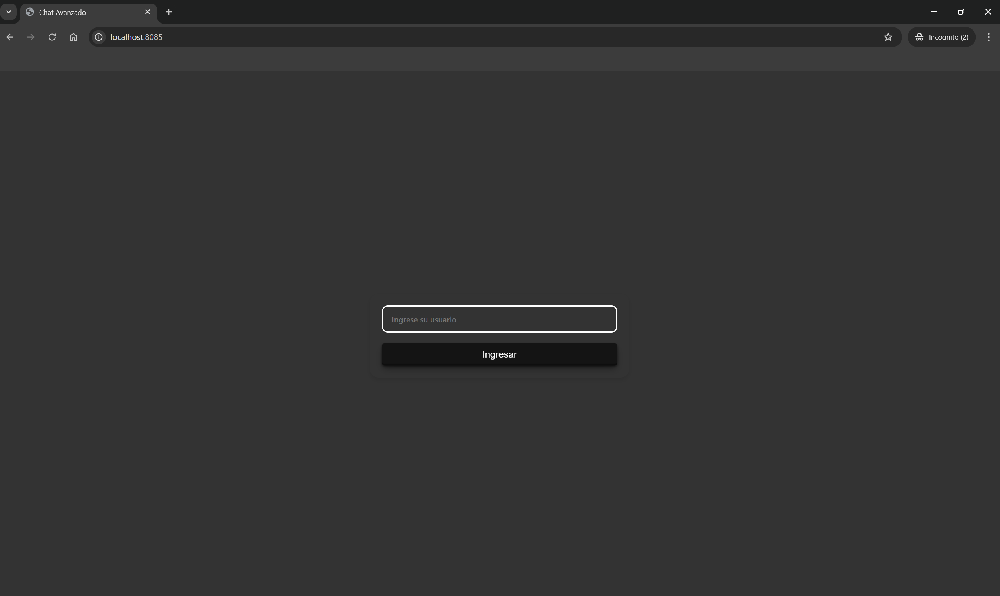
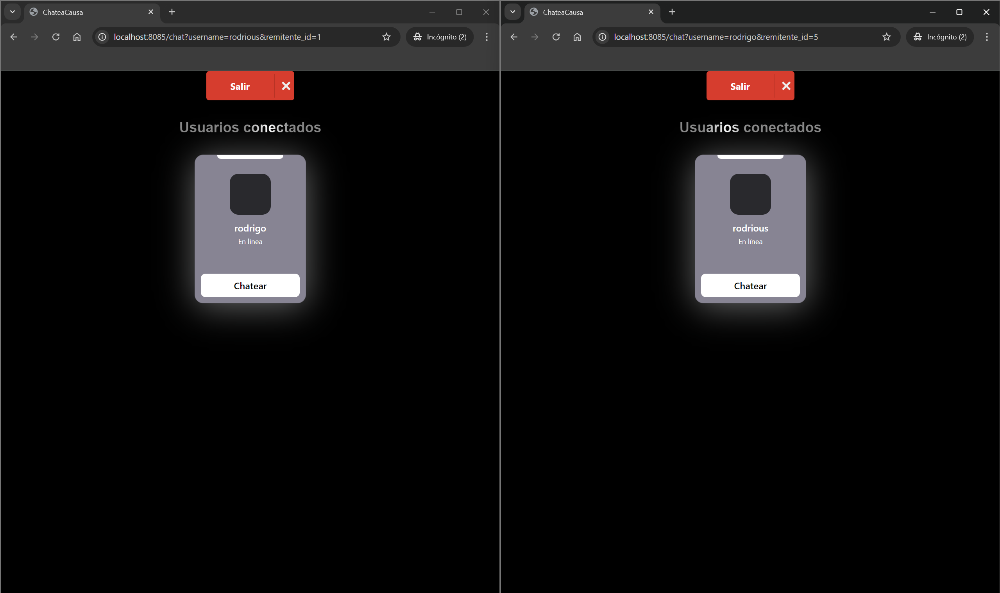
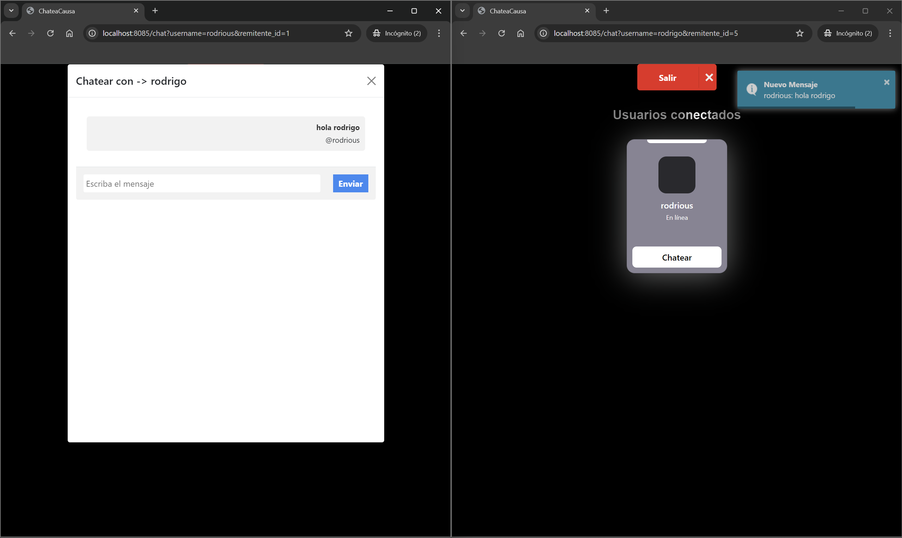
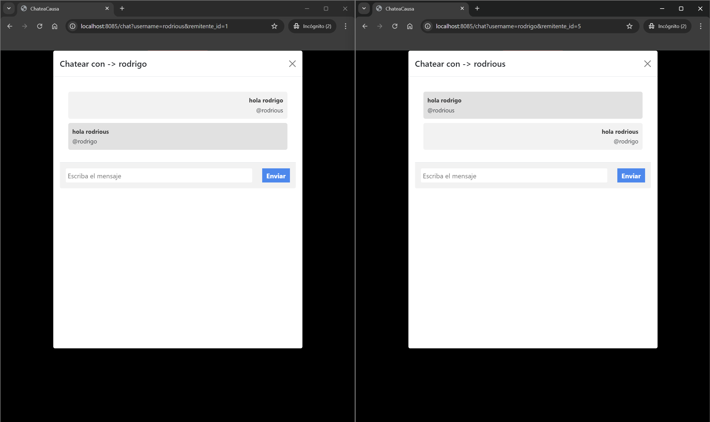
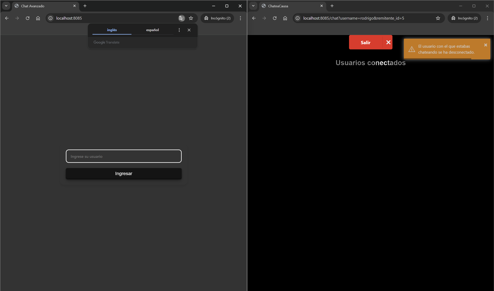

# Aplicación de Comunicación en Tiempo Real 📱👨‍💻

## Desarrollador 
Rodrious 👨‍💻

## Descripción
Esta aplicación web sencilla permite la comunicación en tiempo real entre los usuarios. Utilizando tecnologías modernas como Socket.IO, los usuarios pueden enviar y recibir mensajes instantáneamente, creando una experiencia de chat fluida y eficiente.

## Vista previa de la aplicación 🖥️






Esta es una vista previa de la interfaz de usuario de la aplicación. 🖥️

## Instalaciones 💠
Asegúrate de tener [Node.js](https://nodejs.org/) instalado. Luego, puedes instalar las dependencias necesarias ejecutando el siguiente comando en tu terminal:

```bash
# Instalar las dependencias del proyecto
npm install dotenv@16.4.5 express@4.21.0 morgan@1.10.0 mysql2@3.11.3 socket.io@4.8.0 toastr@2.1.4
```
Esto permitirá a los usuarios copiar y pegar el comando fácilmente para instalar todas las dependencias en un solo paso. ¡Espero que te ayude! 🚀

## Scripts 📜

En el archivo `package.json`, se han definido algunos scripts que facilitan la ejecución y el desarrollo de la aplicación. Aquí hay una breve descripción de cada uno:

- **`dev`**: Este script inicia el servidor en modo de desarrollo. Utiliza el comando `node --watch` para ejecutar el archivo `index.js` ubicado en la carpeta `server`, permitiendo que el servidor se reinicie automáticamente cada vez que se detectan cambios en los archivos del proyecto. Esto es útil para el desarrollo, ya que no es necesario reiniciar el servidor manualmente después de cada modificación.

  Para ejecutar este script, simplemente usa el siguiente comando en tu terminal:

  ```bash
  npm run dev
  ```

